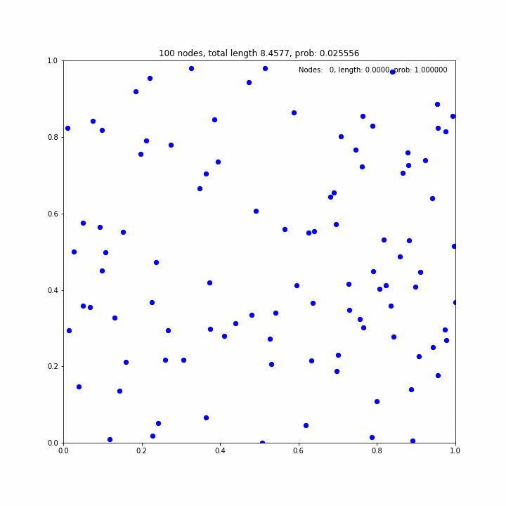
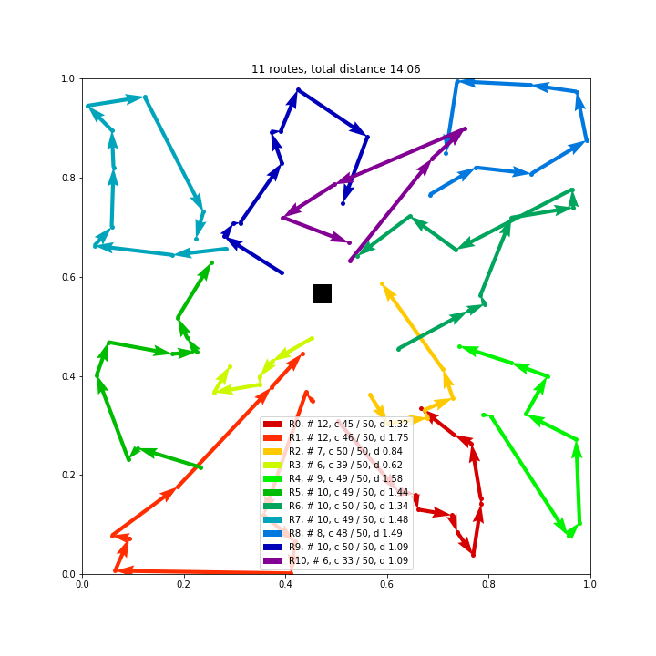

> Note: I am currently not able to actively maintain this repository. Please also checkout more recent implementations, e.g. https://github.com/ai4co/rl4co and https://github.com/cpwan/RLOR.

```python
def run_tsp_ep(tour, x, y, alpha):
    """
    Python interface for the TSP-ep algorithm.
    """    
    # Generate cost matrix with dummy
    Ct, Cd = TSPDrone.cost_matrices_with_dummy(x, y, 1.0, alpha)

    return TSPDrone.exact_partitioning(tour, Ct, Cd)
```
You can use this function to run the TSP-ep algorithm in python. The result will be :
```bash
    print(final_time)
    print(truck_route)
    print(drone_route)

3.945542812785627
[ 1 10  2  7  9  6  4  8 11]
[ 1  3  9  5 11]
```
And the thing you need is the final_time, which is the TSP-D cost.

Note that the input tsp tour should be 1-indexed, also start from 1 and end with 11.
```bash
[ 1 10  2  7  3  9  6  5  4  8 11]
```

Alpha is a parameter that denotes truck : drone speed ratio, and we should target alpha = 1, 2, 3. 

If you see the tsp_ep.py file, you will see
```python
# YOU SHOULD ACTIVATE THIS LINE WHEN YOUR USING CONDA (NOT RECOMMENDED => TOO SLOW)
from julia.api import Julia
jl = Julia(compiled_modules=False) 

from julia import TSPDrone
```
this part at the front. Comment out the first two lines if your not using virtual environment since this will slow down algorithm runtime.
=> I failed to run julia in a plane environment. You should leave these lines active. 

I will open you a server that is ubuntu 22.04, 4 RTX 4090, and python and julia installed. 

I will install packages that are needed to run tsp-ep in julia, therefore you don't need to care about julia.

I will provide you the way to connect to the server via slack.

## GOOD LUCK!


# Attention, Learn to Solve Routing Problems!

Attention based model for learning to solve the Travelling Salesman Problem (TSP) and the Vehicle Routing Problem (VRP), Orienteering Problem (OP) and (Stochastic) Prize Collecting TSP (PCTSP). Training with REINFORCE with greedy rollout baseline.



## Paper
For more details, please see our paper [Attention, Learn to Solve Routing Problems!](https://openreview.net/forum?id=ByxBFsRqYm) which has been accepted at [ICLR 2019](https://iclr.cc/Conferences/2019). If this code is useful for your work, please cite our paper:

```
@inproceedings{
    kool2018attention,
    title={Attention, Learn to Solve Routing Problems!},
    author={Wouter Kool and Herke van Hoof and Max Welling},
    booktitle={International Conference on Learning Representations},
    year={2019},
    url={https://openreview.net/forum?id=ByxBFsRqYm},
}
``` 

## Dependencies

* Python>=3.8
* NumPy
* SciPy
* [PyTorch](http://pytorch.org/)>=1.7
* tqdm
* [tensorboard_logger](https://github.com/TeamHG-Memex/tensorboard_logger)
* Matplotlib (optional, only for plotting)

## Quick start

For training TSP instances with 20 nodes and using rollout as REINFORCE baseline:
```bash
python run.py --graph_size 20 --baseline rollout --run_name 'tsp20_rollout'
```

## Usage

### Generating data

Training data is generated on the fly. To generate validation and test data (same as used in the paper) for all problems:
```bash
python generate_data.py --problem all --name validation --seed 4321
python generate_data.py --problem all --name test --seed 1234
```

### Training

For training TSP instances with 20 nodes and using rollout as REINFORCE baseline and using the generated validation set:
```bash
python run.py --graph_size 20 --baseline rollout --run_name 'tsp20_rollout' --val_dataset data/tsp/tsp20_validation_seed4321.pkl
```

#### Multiple GPUs
By default, training will happen *on all available GPUs*. To disable CUDA at all, add the flag `--no_cuda`. 
Set the environment variable `CUDA_VISIBLE_DEVICES` to only use specific GPUs:
```bash
CUDA_VISIBLE_DEVICES=2,3 python run.py 
```
Note that using multiple GPUs has limited efficiency for small problem sizes (up to 50 nodes).

#### Warm start
You can initialize a run using a pretrained model by using the `--load_path` option:
```bash
python run.py --graph_size 100 --load_path pretrained/tsp_100/epoch-99.pt
```

The `--load_path` option can also be used to load an earlier run, in which case also the optimizer state will be loaded:
```bash
python run.py --graph_size 20 --load_path 'outputs/tsp_20/tsp20_rollout_{datetime}/epoch-0.pt'
```

The `--resume` option can be used instead of the `--load_path` option, which will try to resume the run, e.g. load additionally the baseline state, set the current epoch/step counter and set the random number generator state.

### Evaluation
To evaluate a model, you can add the `--eval-only` flag to `run.py`, or use `eval.py`, which will additionally measure timing and save the results:
```bash
python eval.py data/tsp/tsp20_test_seed1234.pkl --model pretrained/tsp_20 --decode_strategy greedy
```
If the epoch is not specified, by default the last one in the folder will be used.

#### Sampling
To report the best of 1280 sampled solutions, use
```bash
python eval.py data/tsp/tsp20_test_seed1234.pkl --model pretrained/tsp_20 --decode_strategy sample --width 1280 --eval_batch_size 1
```
Beam Search (not in the paper) is also recently added and can be used using `--decode_strategy bs --width {beam_size}`.

#### To run baselines
Baselines for different problems are within the corresponding folders and can be ran (on multiple datasets at once) as follows
```bash
python -m problems.tsp.tsp_baseline farthest_insertion data/tsp/tsp20_test_seed1234.pkl data/tsp/tsp50_test_seed1234.pkl data/tsp/tsp100_test_seed1234.pkl
```
To run baselines, you need to install [Compass](https://github.com/bcamath-ds/compass) by running the `install_compass.sh` script from within the `problems/op` directory and [Concorde](http://www.math.uwaterloo.ca/tsp/concorde.html) using the `install_concorde.sh` script from within `problems/tsp`. [LKH3](http://akira.ruc.dk/~keld/research/LKH-3/) should be automatically downloaded and installed when required. To use [Gurobi](http://www.gurobi.com), obtain a ([free academic](http://www.gurobi.com/registration/academic-license-reg)) license and follow the [installation instructions](https://www.gurobi.com/documentation/8.1/quickstart_windows/installing_the_anaconda_py.html).

### Other options and help
```bash
python run.py -h
python eval.py -h
```

### Example CVRP solution
See `plot_vrp.ipynb` for an example of loading a pretrained model and plotting the result for Capacitated VRP with 100 nodes.



## Acknowledgements
Thanks to [pemami4911/neural-combinatorial-rl-pytorch](https://github.com/pemami4911/neural-combinatorial-rl-pytorch) for getting me started with the code for the Pointer Network.

This repository includes adaptions of the following repositories as baselines:
* https://github.com/MichelDeudon/encode-attend-navigate
* https://github.com/mc-ride/orienteering
* https://github.com/jordanamecler/PCTSP
* https://github.com/rafael2reis/salesman
